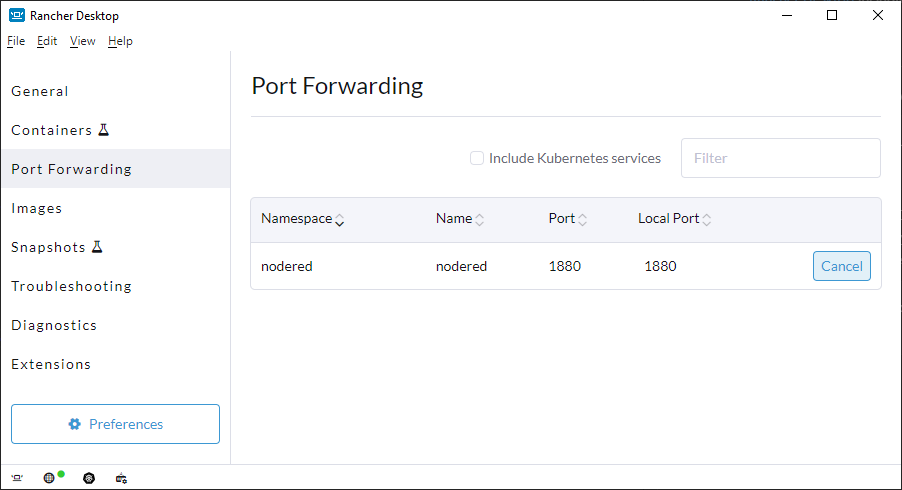

# Node-RED on Rancher Desktop with Host Directory Mount

This repository contains Kubernetes configuration files to deploy Node-RED on Rancher Desktop with a mounted host directory within the cluster. There are many examples out there, but this one specifically addresses the problem I encountered when trying to mount the host directory as a persistent volume.

## Prerequisites

Before you begin, ensure you have the following installed:

- [Rancher Desktop](https://rancherdesktop.io/) including Docker and Kubernetes

## Getting Started

1. Clone this repository to your local machine:

```bash
git clone https://github.com/StilleQuelle308/nodered-on-rancher.git
cd nodered-on-rancher
```

2. Customize the Node-RED deployment configuration in deployment.yaml file if needed.
3. Update the host directory path settings in nodered-pv-pvc.yaml file.
4. Deploy Node-RED to the cluster:

```bash
kubectl create namespace nodered
kubectl apply -k .
```
5. Enable port-forwarding in Rancher Desktop:



5. Access Node-RED: Once the deployment is complete, you can access Node-RED by navigating to http://localhost:1880 in your web browser.

## Configuration
### Node-RED Deployment Configuration
You can customize Node-RED deployment parameters in the deployment.yaml file, such as environment variables, resources, etc.

### Persistent Volume Configuration
The nodered-pv-pvc.yaml file defines a hostPath PersistentVolume. Update the path field to specify the host directory you want to mount within the Node-RED pod.

